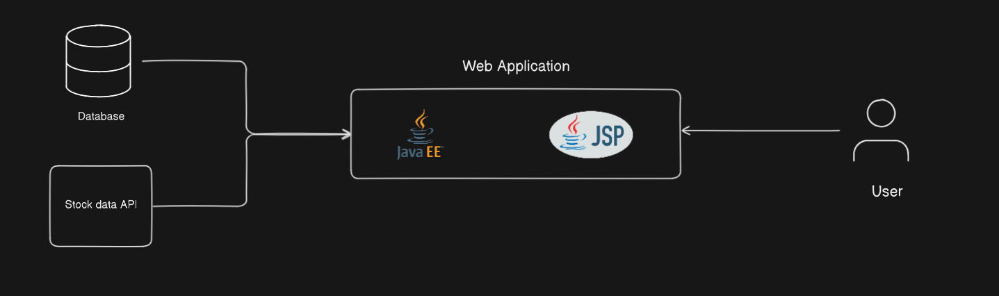
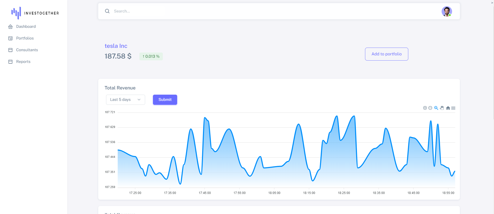
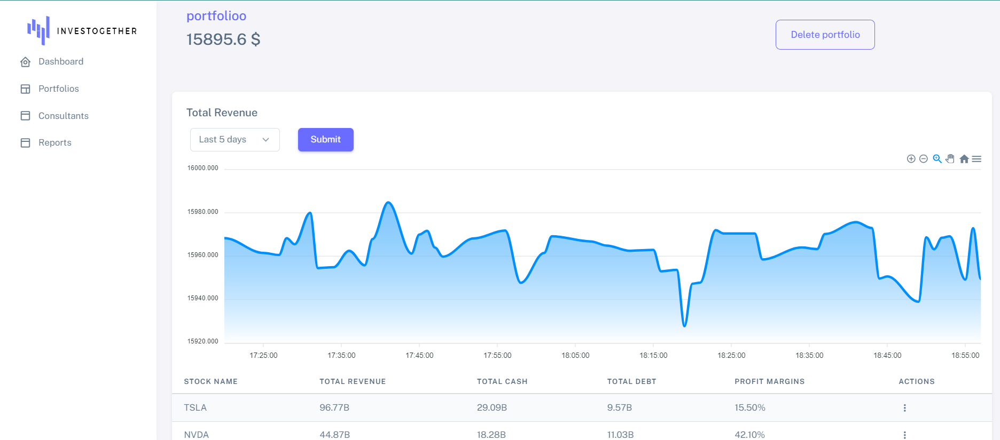

# Financial Portfolio Management App

## Project Overview

The Financial Portfolio Management App is a web-based application that allows users to view real-time stock prices, add stocks to their portfolio, and manage their investments. Built using Java Enterprise Edition (JEE) with Servlets and JSP, the app provides a simple interface for users to track and manage their financial portfolios.

## Features

- **Stock Price Viewing**: Users can search for and view real-time stock prices.
- **Portfolio Management**: Users can add stocks to their personal portfolio, remove stocks, and track their portfolio’s performance.
- **Real-Time Updates**: Stock prices are regularly updated to ensure users have the latest data for their portfolio.
- **User Authentication**: Secure login and session management for each user.

## Tech Stack

- **Backend**:
  - Java Enterprise Edition (JEE)
  - Servlets (for handling requests)
  - JSP (for dynamic content rendering)
  - JDBC (for database interactions)
- **Frontend**:
  - HTML/CSS (for user interface)
  - JavaScript (for interactive components)
- **Database**:
  - MySQL (for user and portfolio data storage)

## Architecture

Below is the architecture of the Financial Portfolio Management App:

## Final Results

Shows a list of stocks in the user’s portfolio, including real-time prices and total portfolio value.

